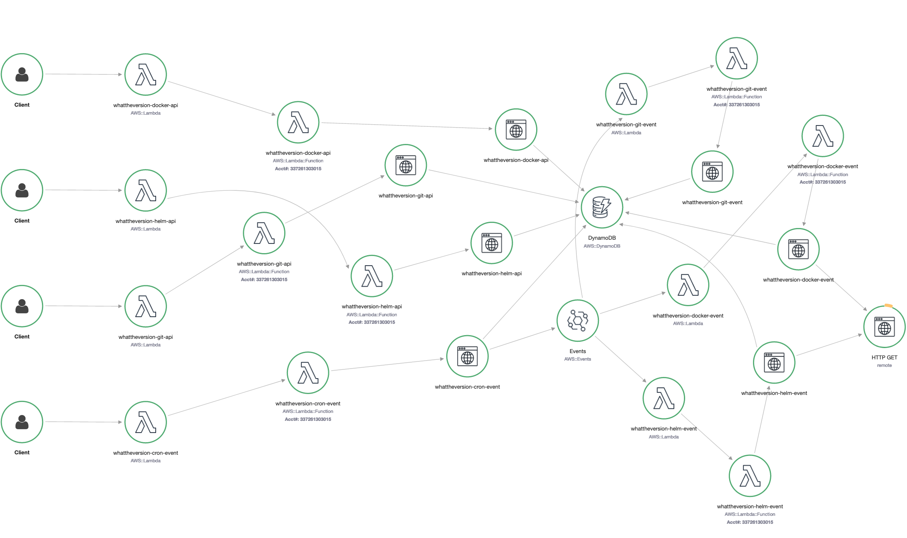

# whattheversion

REST api to retrieve the latest available versions for git, docker images or helm charts.
See the open api docs for the available endpoints with examples: https://whattheversion.hutter.cloud

A script using the API can be found in the repository [update-versions](https://github.com/huttercloud/update-versions) and github actions using the script to automatically update versions for terraform and helm can be found in the repositories [infrastructure](https://github.com/huttercloud/infrastructure/blob/main/.github/workflows/update-versions.yaml) and [applications](https://github.com/huttercloud/applications/blob/main/.github/workflows/update-versions.yaml).

## overview



The solution consists of multiple AWS components:
- API Gateway: Enables api endpoints for docker, helm and git queries
- Cloudfront: Allows routing to swagger ui and /api endpoints via https://whattheversion.hutter.cloud
- DynamoDB: Stores the last 500 versions of the queried registries
- EventBridge: Custom events are used to instruct the event lambdas to scan for new versions
- Lambdas:
  - cron-event: Triggered every 12 hours, scans entries in dynamodb and sends an update event for each
  - docker-api: Api Endpoint, queries for docker images tags in dynamodb
  - docker-event: Triggered by api or cron-event to search for docker image tags
  - git-api: Api Endpoint, queries for git tags in dynamodb
  - git-event: Triggered by api or cron-event to search for git tags
  - helm-api: Api Endpoint, queries for helm chart versions in dynamodb
  - helm-event: Triggered by api or cron-event to search for helm chart versions

## usage

The api endpoints are public and can be queries with POST.
Depending on the endpoint a different request format is required. See the [swagger ui](https://whattheversion.hutter.cloud) for examples.

If the git repository, docker repository or helm chart is queried for the first time the API will return a 404 and send an event to the corresponding event lambda which triggers a scan for the specified repository.

## deploy

simply run `make deploy`

```bash

## development

### development ports
- http://localhost:4566: localstack dynamodb and eventbridge
- http://localhost:8001: dynamodb web interface
### requirements
- docker and docker-compose
- python3
- aws sam cli

### prepare venv

```bash
python3 -m venv venv
source venv/bin/activate
pip install --upgrade pip
pip install -r requirements.txt
```

### start local dev environment

```bash
make dev
```
